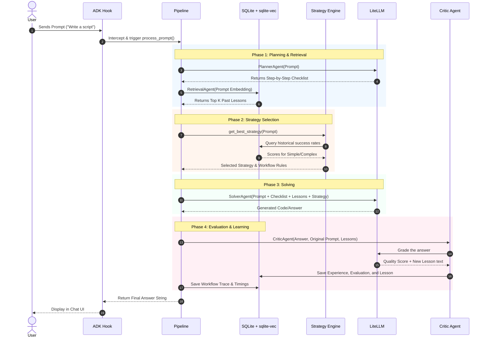
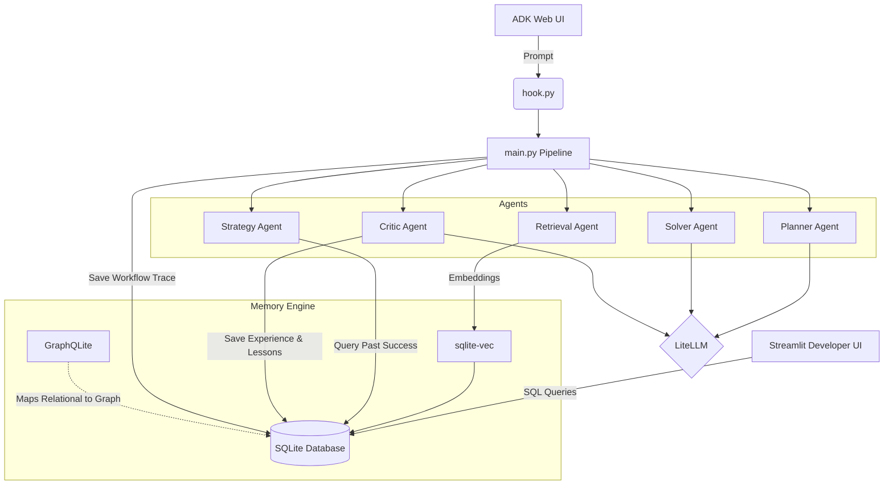

# 🏛️ High-Level Technical Architecture

The **Self-Improving Agents** application is a modular, local-first Python system built on top of an asynchronous execution pipeline, a SQLite-based memory engine, and the Google ADK (Agent Development Kit). 

## 1. Core Components

1. **ADK Integration (`hook.py`)**: 
   - Intercepts user messages from the ADK Web UI.
   - Redirects the prompt into our custom `process_prompt` async workflow instead of passing it to a generic LLM.

2. **The Execution Pipeline (`main.py`)**:
   - The orchestrator. It executes the agents sequentially and passes state between them.
   - It captures the `duration_ms` for each agent and generates a unique `workflow_execution_id` for traceability.

3. **Memory & Vector Database (`memory/database.py`)**:
   - Uses **SQLite** for relational storage (Experiences, Evaluations, Strategies, Workflows).
   - Uses **sqlite-vec** for vector embeddings. The Retrieval agent converts text into vector embeddings using the `nomic-embed-text` model and performs cosine-similarity search to find related past experiences.
   - Uses **GraphQLite** (`graph.py`) to map relational data into graph nodes and edges so that complex paths (e.g., Task -> Workflow -> Experience -> Evaluation -> Lesson) can be visualized.

4. **Agents (`agents/`)**:
   - Each agent (`planner.py`, `retrieval.py`, `solver.py`, `critic.py`) wraps a call to **LiteLLM**. 
   - We use `Llama 3.2` as the local language model. 

5. **Strategy Engine (`strategy/`)**:
   - Maintains a dynamic registry of workflows (e.g., Simple, Complex, Debug).
   - Chooses a strategy based on Epsilon-Greedy logic (90% Exploitation of the best historical score, 10% Exploration of random strategies).

6. **Developer UI (`developer_ui/`)**:
   - A **Streamlit** application that directly queries the local SQLite database to render dashboards (Execution Trace, Memory Browser, Strategy Performance, and Continuous Improvement Benchmarks).

---

## 2. Sequence Diagram

This diagram shows the exact technical flow when a user sends a prompt through the chat interface.

---

## 3. Database Schema Overview

The relational structure that powers the learning loop:

- `workflow_executions`: Logs the execution trace (durations of all agents).
- `strategy_preferences`: The available strategies and their exploration counts.
- `experiences`: The actual user prompt and the Solver's answer. Linked to the workflow.
- `evaluations`: The Critic's grade (`correct` boolean, `quality` string). Linked to the experience.
- `lessons`: The written text explaining what went wrong (or right). Linked to the evaluation. This table contains the `embedding` column powered by `sqlite-vec`.

---

## 4. Component Diagram

This diagram illustrates the high-level structural dependencies and how each component interacts.

